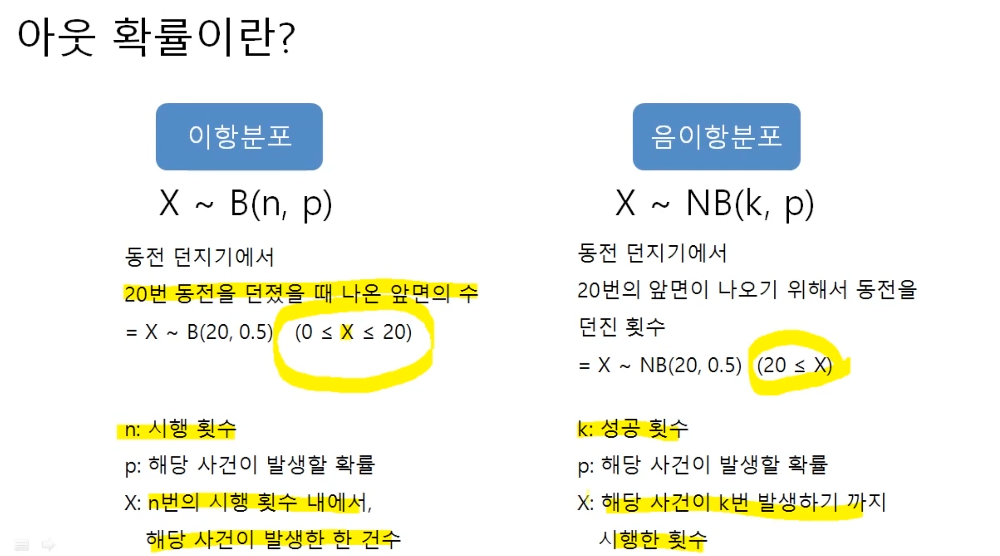
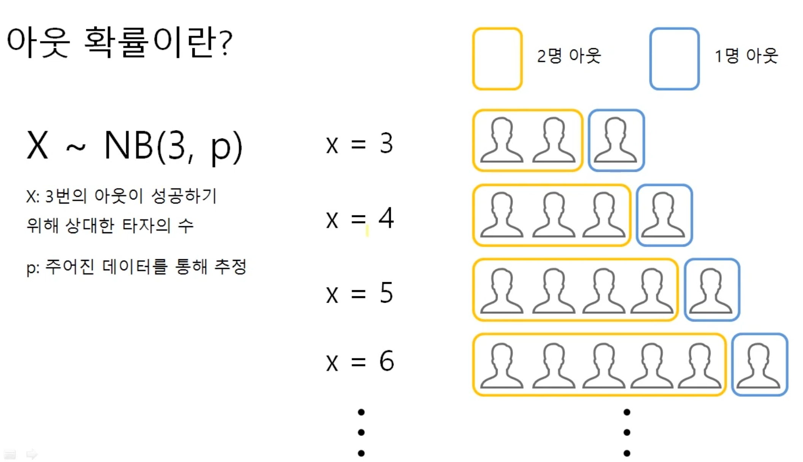

# Sweet Statistics

Paring statistics concepts with real-life examples based on three questions.

* Which field is using which statistics?
* What are the values produced with statistics, that customers find useful?
* What are the insights that can be drawn from dataset using Python/R? 


## KBO 용병 외국인 투수 성적 예측

statcast 데이터의 1) 구종 개수와 2) 아웃확률로 기존에 성공한 외국인 투수 성적들을 바탕으로 새로 들어온 외국인 투수를 평가한다

### Key Notes

* 아웃확률은 음이항분포로 정의함
* 이항분포는 시행횟수를 고정해서 아웃을 몇 번 성공했냐를 봄
* **음이항분포는성공 횟수를 고정해서, 시행횟수를 몇 번 시행해야만 하냐를 봄**



* 여기서 3번의 아웃이 성공하기 위해 상대한 타자의 수가 X임



### Reference

* [YouTube Video: Code Explanation](https://www.youtube.com/watch?v=xExpvGsmLzE)
* [Paper: Modeling Pitcher Performance and the Distribution of Runs per Inning in Major League Baseball](./papers/modeling_pitcher_performance.pdf)


## Movie Recommendation Algorithm

Using pearson correlation to get similar movies based on user's ratings

* Movies dataset: 45,000 movies featured in the Full MovieLens dataset
* Ratings dataset: 100,000 ratings from 700 users on 9,000 movies

### Key Notes

* Netflix recommends movies that are similar to other films that I've liked; it also recommends films that have been highyl rated by other customers whose ratings are similar to mine.
* First, I rate a set of films. Netflix compares my ratings with those of other customers to identify those whose ratings are highly correlated with mine. Those customers tend to like the films that I like. Once that is established, **Netflix can recommend films that like-minded customers have rated highly but I have not yet seen.** 
* Correlation measures the degree to which two phenomena are related to one another. Two variables are positively correlated if a change in one is associated with a change in the other in the same direction.
* Correlation coefficient collapses a complex mess of data measured in different units(ft, oz, lbs, rating...) into a single elegant descriptive statistic 

```python
# https://www.uv.es/visualstats/vista-frames/help/lecturenotes/lecture11/pearson-ovrh.html
def person_r_value(movie1_ratings, movie2_ratings):
    # deviations
    movie1_ratings_deviation = movie1_ratings - movie1_ratings.mean()
    movie2_ratings_deviation = movie2_ratings - movie2_ratings.mean()
    
    # shared variance between x and y
    # using algebraic formula, thus using sum of product of ratings_deviation instead of covariance
    sum_of_product_of_deviations = np.sum(movie1_ratings_deviation * movie2_ratings_deviation) 
    
    # separate variance of X and Y
    movie1_ratings_sum_of_squares = np.sum(movie1_ratings_deviation**2)
    movie2_ratings_sum_of_squares = np.sum(movie2_ratings_deviation**2)
    sum_of_product_of_standard_deviations = np.sqrt(movie1_ratings_sum_of_squares * movie2_ratings_sum_of_squares)
    
    pearson_correlation = sum_of_product_of_deviations / sum_of_product_of_standard_deviations
    
    return pearson_correlation
```

### Reference

* [Youtube Video](https://www.youtube.com/watch?v=mLwMe4KUZz8)
* [Naked Statistics | Chapter 4: How does Netflix know what movies I like?](https://www.academia.edu/15178144/Naked_Statistics)
* [Jupyter Notebook: Code](https://github.com/snoop2head/pd_bamboo_forest/blob/master/Movie-recommendation-algorithm.ipynb)

